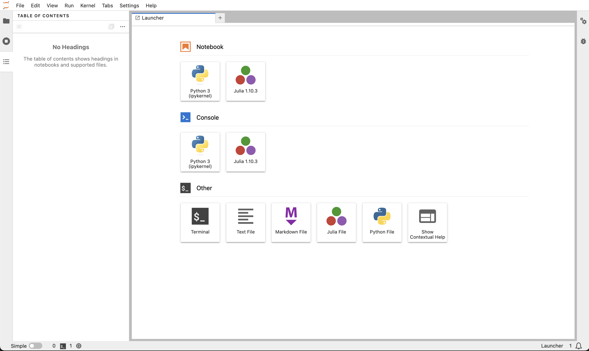

<div align = "right">
<details>
<summary><b>Language</b></summary>

[English](https://github.com/hibiki-kato/Lecture_Julia)  
[日本語](https://github.com/hibiki-kato/Lecture_Julia_ja)
</details>
</div>

# Juliaへようこそ！
このページは，プログラミング初心者向けJuliaレッスンの日本語版です．
 

**目次**

- [Juliaへようこそ！](#juliaへようこそ)
- [レッスンリスト(準備中\&適当)](#レッスンリスト準備中適当)
- [Juliaのインストール方法](#juliaのインストール方法)
- [パッケージのインストール方法](#パッケージのインストール方法)
- [エディタとIDE](#エディタとide)
  - [Visual Studio Code](#visual-studio-code)
  - [JupyterLab](#jupyterlab)
- [レポジトリレイアウト](#レポジトリレイアウト)


# レッスンリスト(準備中&適当)
各レッスンのプログラムは`src`フォルダにあります．

Google Colaboratoryでコードを実行したい場合は、[こちら](https://colab.research.google.com/github/ageron/julia_notebooks/blob/master/Julia_Colab_Notebook_Template.ipynb)に従ってください
|回| 概要|ファイル|
| :--------: | --------------------------- | :-----: |
| レッスン1  | Julia概要 | [](https://colab.research.google.com/github/hibiki-kato/Lecture_Julia_ja/blob/main/src/lesson1.ipynb) |
| レッスン2  | 変数・データ型| [](https://colab.research.google.com/github/hibiki-kato/Lecture_Julia_ja/blob/main/src/lesson2.ipynb) |
| レッスン3  | 制御フロー|[](https://colab.research.google.com/github/hibiki-kato/Lecture_Julia_ja/blob/main/src/lesson3.ipynb)|
| レッスン4  | 関数|[](https://colab.research.google.com/github/hibiki-kato/Lecture_Julia_ja/blob/main/src/lesson4.ipynb)|
| レッスン5  | データ構造||
| レッスン6  | ファイル入出力||
| レッスン7  | パッケージの使い方          |                                                                                                                                                                                 |
| レッスン8  | データの可視化              |                                                                                                                                                                                 |
| レッスン9  | データの前処理              |                                                                                                                                                                                 |
| レッスン10 | 機械学習                    |                                                                                                                                                                                 |
| レッスン11 | ディープラーニング          |                                                                                                                                                                                 |
| レッスン12 | パフォーマンスチューニング  |                                                                                                                                                                                 |
| レッスン13 | GPUプログラミング           |                                                                                                                                                                                 |
| レッスン14 | 並列プログラミング          |                                                                                                                                                                                 |
| レッスン15 | データベースの使い方        |                                                                                                                                                                                 |
| レッスン16 | Webアプリケーションの作り方 |                                                                                                                                                                                 |
| レッスン17 | データサイエンスの基礎      |                                                                                                                                                                                 |
| レッスン18 | データサイエンスの実践      |                                                                                                                                                                                 |


# Juliaのインストール方法
ここでも説明しますが，詳しくは[公式ウェブサイト](https://julialang.org/downloads/)を参照してください。

公式のバージョン管理ソフト[Juliaup](https://github.com/JuliaLang/juliaup)を使用してインストールしてください。
まず，以下のコマンドを，ターミナル(PowerShell)で実行してください．

```sh
# Windows
> winget install julia -s msstore

# macOS or Linux
$ curl curl -fsSL https://install.julialang.org | sh

# homebrew
$ brew install juliaup
```

特定のバージョンのJuliaをインストールするために，以下を実行してください．
```sh
juliaup add <version>
```
`<version>`は入れたいバージョンに置き換えてください．

*e.g.* `juliaup add 1.10`


# パッケージのインストール方法
ターミナル(PowerShell)を開いて，`julia`を実行してください．対話型のコマンドライン**REPL**が起動します．

```sh
$ julia
               _
   _       _ _(_)_     |  Documentation: https://docs.julialang.org
  (_)     | (_) (_)    |
   _ _   _| |_  __ _   |  Type "?" for help, "]?" for Pkg help.
  | | | | | | |/ _` |  |
  | | |_| | | | (_| |  |  Version 1.10.3 (2024-04-30)
 _/ |\__'_|_|_|\__'_|  |  Official https://julialang.org/ release
|__/                   |

julia>
```
そこで，`]`を押してください．その後，`add`コマンドを使ってパッケージをインストールします．
```sh
$ (@v1.10) pkg> add <packagename>
```
を実行すれば，パッケージがインストールされます．`<packagename>`はパッケージの名前に置き換えてください．*e.g.* `add Plots`

このレッスンでは以下のパッケージを使用します．

<dl>
  <li> Plots </li>
  <dd>データを視覚化するためのグラフソフト．</dd>
  <li> PyPlot </li>
  <dd>データを視覚化するためのグラフソフト(matplotlibのJulia版)．</dd>
  <li> IJulia </li>
  <dd>JuliaをJupyterLabで使用するためのパッケージ．</dd>
  <li> <a href="https://juliadynamics.github.io/DynamicalSystems.jl"> DynamicalSystems </a> </li>
  <dd>非線形力学系と非線形時系列解析のための強力なライブラリ．</dd>
  <li> <a href="https://github.com/JuliaGPU/KernelAbstractions.jl/tree/main"> KernelAbstractions </a> </li>
  <dd><s> NVIDIA, AMD, Intel, Appleと異なるベンダーのGPU向けのコードを共通の1つのコードで使えるようにするパッケージ．</s>></dd>
</dl>

```sh
$ (@v1.10) pkg> add Plots PyPlot IJulia DynamicalSystems KernelAbstractions
```

# エディタとIDE
コーディングには，高機能なエディタやIDEが欠かせません．  
エディタとは，プログラムを書くためのテキストエディタのことで，IDEは，エディタに加えて，デバッグやビルド(プログラムを機械語に変換)や実行などの機能を提供する統合開発環境のことです．

Juliaのコードを書くために使えるエディタやIDE(統合開発環境)は．多岐にわたります．詳細は[こちら](https://julialang.org/tools/)を参照してください．

このレッスンでは，以下のエディタ，IDEのインストール方法を紹介します．
- [Visual Studio Code](https://code.visualstudio.com/)
- [JupyterLab](https://jupyter.org/)

## Visual Studio Code
[ここ](https://code.visualstudio.com/)からVisual Studio Codeをインストールしてください．コマンドでインストールする場合は以下のコマンドを実行してください．

```sh
# Windows
> winget install vscode
# macOS
$ brew install --cask visual-studio-code
# Linux
$ sudo apt install code
```

インストーラに従って，インストールが完了したら，Visual Studio Codeを開いてください．チュートリアルを終えたら，左側の拡張機能のアイコンをクリックして，拡張機能をインストールしましょう．

<div style="width: 100%; max-width: 1000px;">
  
  </a>
</div>

推奨する拡張機能は以下の通りです．
<dl>
  <li> Julia (必須)</li>
  <dd> Julia用の拡張機能． </dd>
  <li> Jupyter (必須)</li>
  <dd> VS codeでJupyterのノートブック形式を使えるようになります．</dd>
  <li> Japanese Language Pack for Visual Studio Code </li>
  <dd> VS codeの日本語化拡張機能．</dd>
  <li> Path Intellisense </li>
  <dd> ファイルパス(場所)を入力する際に補完機能を提供します．</dd>
  <li> GitHub Copilot </li>
  <dd> AIによる高度なコード補完機能．<a href="https://github.com/edu" target="_blank">Github Education</a>から教育機関のメールアドレスで登録すれば．無料で使えます．
  学生証のアップロードの方法などは<a href ="https://docs.github.com/ja/education/explore-the-benefits-of-teaching-and-learning-with-github-education/github-education-for-students/apply-to-github-education-as-a-student" target="_blank">こちら</a>を参照してください．AIのサポートはコーディングにパラダイムシフトを起こしているので，ぜひ活用してください．
  </dd>
  <li> zenkaku </li>
  <dd> バグの温床である全角文字を検出してくれる拡張機能． </dd>
  <li> vscode-icons </li>
  <dd> ファイルアイコンを見やすくする拡張機能．</dd>
</dl>

上のJuliaインストールと合わせて，これでJuliaの環境が整いました．

## JupyterLab

JupyterLabはAnacondaをインストールすることで使用できます．[ここ](https://www.anaconda.com/products/distribution)からAnacondaをインストールしてください．(サインアップの必要はありません)

Anaconda Navigatorを開いて，JupyterLabを起動してください．

<div style="width: 100%; max-width: 1000px;">
  <a href="https://pages.michinobu.jp/t/installanaconda.html" target="_blank">
  
  </a>
</div>

Anaconda Navigatorが使えない場合は，以下のコマンドを実行してください．

```sh
# Windows (Anaconda Prompt)
> jupyter lab
# macOS or Linux
$ jupyter lab
```

JupyterLabがインストールされていない場合は以下のコマンドを実行してください．

```sh
# Windows (Anaconda Prompt)
> conda install -c conda-forge jupyterlab

# macOS or Linux
$ conda install -c conda-forge jupyterlab
```

JupyterLabを開いて，Juliaのアイコンがあれば，Juliaが使える環境が整っています．新しいノートブックを作成するには，一番上のNotebookのうち，Juliaを選択してください．

<div style="width: 100%; max-width: 1000px;">
  
</div>

# レポジトリレイアウト
```sh
.
├── auto_pull
├── data
└── src
    └── assets
```

<dl>
    <dt>auto_pull</dt>
    <dd>
    <details open>
    <summary><b>ここに格納されているファイルを以下のように実行することでこのレポジトリの更新をローカルに反映させます．</b></summary>
    <li>Windows</li>
          <pre><code class="language-sh">> .\auto_pull\pull.ps1</code></pre>
          <li>macOS or Linux</li>
          <pre><code class="language-sh">$ zsh ./auto_pull/pull.sh</code></pre>
    </details>
    </dd>
    <dt>data</dt>
    <dd>データファイルを保存するフォルダです．</dd>
    <dt>src</dt>
    <dd>ソースコードや画像ファイルを格納するフォルダです。</dd>
</dl>